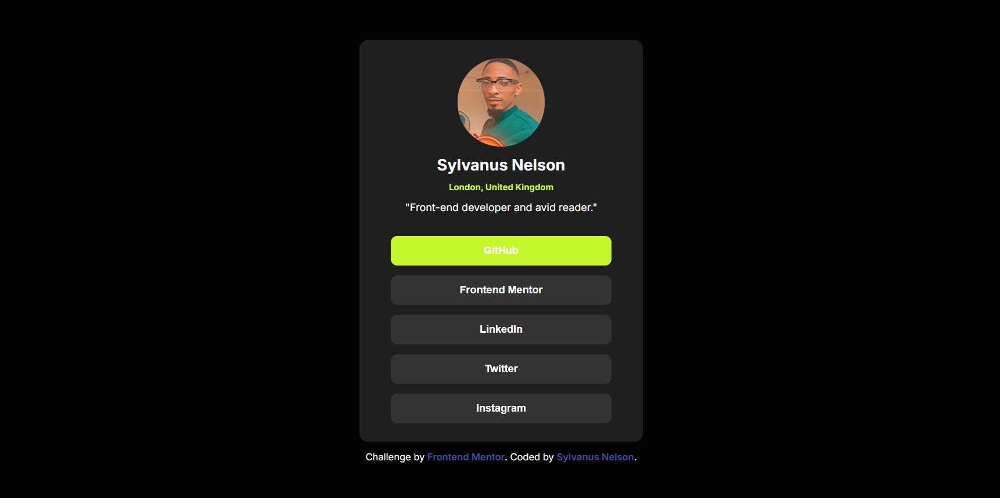

# Frontend Mentor - Social links profile solution

This is a solution to the [Social links profile challenge on Frontend Mentor](https://www.frontendmentor.io/challenges/social-links-profile-UG32l9m6dQ). Frontend Mentor challenges help you improve your coding skills by building realistic projects. 

## Table of contents

- [Overview](#overview)
  - [The challenge](#the-challenge)
  - [Screenshot](#screenshot)
  - [Links](#links)
- [My process](#my-process)
  - [Built with](#built-with)
  - [What I learned](#what-i-learned)
  - [Continued development](#continued-development)
- [Author](#author)


## My process

### The challenge

Users should be able to:

- See hover and focus states for all interactive elements on the page

### Screenshot




### Links

- Solution URL: [Add solution URL here](https://your-solution-url.com)
- Live Site URL: [Add live site URL here](https://your-live-site-url.com)

## My process

### Built with

- Semantic HTML5 markup
- CSS custom properties
- Flexbox
- Mobile-first workflow
- [Styled Components](https://styled-components.com/) - For styles


### What I learned

I learnt how to use base-style on my css design. This is a new concept I saw while reviewing a peer's work on a previous task and felt the urge to try it out.


```css
:root {
  --green: hsl(75, 94%, 57%);
  --white: hsl(0, 0%, 100%);
  --gray-700: hsl(0, 0%, 20%);
  --gray-800: hsl(0, 0%, 12%);
  --gray-900: hsl(0, 0%, 8%);
  --gray-999: hsl(0, 0%, 1%);
}

p {
  font-size: var(--font-size-base);
  font-weight: var(--font-weight-regular);
  color: var(--gray-700);
  margin-bottom: 1rem;
}
```

### Continued development

I would like to continue working on my mobile first dsign and also refine the usage of base-style in css.


## Author

- Frontend Mentor - [@ugokams](https://www.frontendmentor.io/profile/yourusername)
- Twitter - [@SylvanusNe75846](https://www.twitter.com/yourusername)


